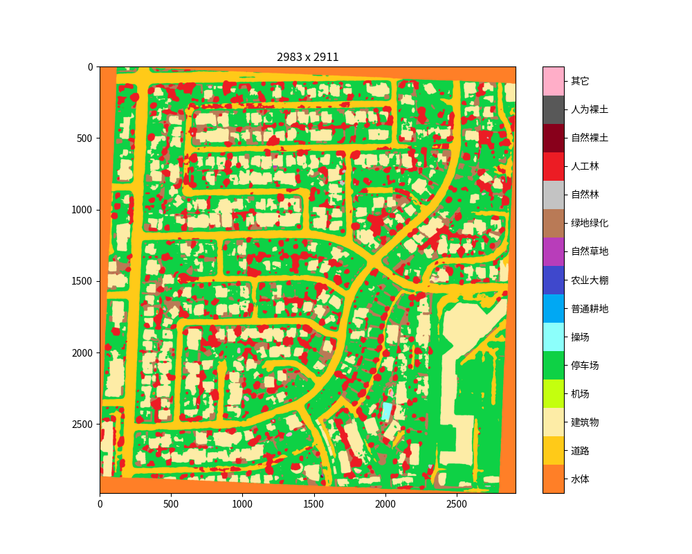

# Repo for NAIC AI + RemoteSensing Image Segmentation
## Team 木已成舟
### Final Rank 14

此Repo包含了本队伍所有代码文件以及内容概述

### 赛后总结
啰嗦几句，主要是关于本队伍进行的各种尝试，以及实现的各种方案：
模型包括UNet，UNet++，DANet，BASNet，Deeplabv3+，HRNet_OCR，PSPNet,RefineNet，PointRend等，代码均已开源，同时支持resnet，resnext，Resnest，xception等backbone以及scSE，ASPP等常用特征增强Block；数据增广使用flip和rotate；训练采用SGD和带热重启的余弦学习率调整策略，因资源不足未使用伪标签的40W图片进行训练；其他实现的trick包括Sync BN，Label Smooth，在线边缘Label Smooth，Pseudo Label等；推理环节实现了支持各种参数的膨胀预测，包括可固定中心及膨胀尺寸策略，以及自适应最小边角料策略，另外，本组也实现了测试时增强策略，限于时间有限，复赛未采用；提供可视化脚本，效果如github readme所示；针对模型存储大小，使用Huffman编码对参数进行压缩，复赛环节500M限制内，最多可实现12小时完成4模型集成（HRNet_OCR + DANet + Deeplabv3+ * 2）推理任务（logits平均集成法）。经赛后完整训练，单模型仍有3分（百分制）提升空间，**本方案在卡多的情况下，足以进入决赛**。另外可使用的提速策略包括半精度，删去resnet类backbone中的layer 4（可能略微损失精度，不完全训练下精度相近）。可提升精度的方案包括在backbone中最后两个Layer加入dilated conv。可尝试的损失函数包括lovasz，Focal，BCE，Dice，以及上述损失函数的混合策略，以及单独使用某个loss对模型进行微调。另外提高数据质量的方法，可以根据模型预测的mIoU设定阈值，找出预测效果极差的部分样本，从训练集去除，因为本次比赛数据集质量一般。最重要的提分策略就是充分训练，充分微调，高效集成，因为本队伍未进入决赛，所以为决赛准备的知识蒸馏方法未提供，基本思想就是使用大模型预测的logits，作为小模型训练时的GT，这些logits相比于Hard Label，还包含了类间信息，更有利于模型学习。集成可采用不同backbone的同模型集成，也可以使用不同局部最优点的相同模型集成，效果均十分明显。如有任何问题，欢迎提issue，**更建议邮件/QQ联系**，本人会及时回复，邮箱530781348@qq.com。


### 初赛说明
目录说明如下：  
-- dilated：DANet所使用的dilated resnet backbone代码  
-- loss：损失函数代码  
-- models，modules，utils_Deeplab：所有模型代码  
-- traning_log_stage_1：初赛A榜训练日志  
-- *.py：工具方法以及训练文件  
-- ensemble_test：最终使用的推理文件，用于复现A，B榜所有提交结果（路径按需设置）

PS：由于文件大小限制，本队伍所使用的模型已放在百度网盘，链接见[方案说明](https://github.com/JasmineRain/NAIC_AI-RS/blob/master/METHOD.md)

### 复赛说明
复赛要求基本一致，从8类预测提升到了15类

首先给出效果预览，图片取自于网上随意找的遥感图像，实际实现过程中未使用外部数据集



#### 算法说明
- 本队伍选取采用的模型为DANet, Deeplabv3+, HRNet_OCR
- backbone选取resnet-101, resnest-101
- 预处理为常规的normalization
- 数据增广使用简单的翻转和旋转，如data_loader文件所示
- 优化器选取SGD，学习率调整策略为CosineAnnealingWarmRestarts
- 最终使用4模型集成，包括两种backbone的Deeoplabv3+，resnet101的DANet，以及HRNet_OCR，集成方法为logits求平均
- 由于提交压缩包大小限制，本队伍使用了huffman编码对模型的参数文件进行压缩，确保大小合适
- 由于复赛测试数据大小可变，本队伍对大于1024分辨率的图片进行裁剪，裁剪大小自适应地从1024-512选取，间隔64像素，
以达到裁剪出的边角料最少的效果，避免边角料效果过差。另外，为了消除拼接过于明显的问题，本队伍采用了膨胀预测的方法，
即裁剪时上下左右多裁剪若干像素，取出预测结果的中间部分作为目标区域拼接
- 代码使用Pytorch 1.6.0，复赛训练环境为4x2080Ti+4x1080Ti
- 实现的其它trick包括Sync BN, Label Smooth, Online Edge Label Smooth, Pseudo Label等

#### 复现说明（仅用于云脑平台复现，本项目为完整代码，云脑平台为简化版的复现代码）
说明pdf为Desciption.pdf
直接在云脑项目根目录执行 ```bash run.sh``` 即可全自动复现模型，注意，最终将在./submit/目录生成一个submit.zip，
即为复赛系统要求格式的文件，最终复赛提交的.zip文件[链接](http://212.64.70.65/static/images/submit.zip)
本队伍使用到的预训练模型(均为官方论文发布的模型)：
[resnet101](https://download.pytorch.org/models/resnet101-5d3b4d8f.pth)
[resnest101](https://s3.us-west-1.wasabisys.com/resnest/torch/resnest101-22405ba7.pth)
[hrnetocr](http://212.64.70.65/static/images/hrnet_ocr_cs_trainval_8227_torch11.pth)

#### Reference
[ResNeSt](https://github.com/zhanghang1989/ResNeSt#pretrained-models)
[HRNet_OCR](https://github.com/HRNet/HRNet-Semantic-Segmentation/tree/HRNet-OCR)
